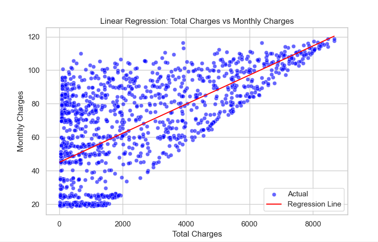

# Salary Prediction using Linear Regression

This project demonstrates a **simple linear regression model** to predict **Monthly Charges** based on **Total Charges** using the Telco Customer Churn dataset. The model is trained and evaluated using **MAE, MAPE, and MSE**, and results are visualized in a **modern, minimalistic scatter plot with a regression line**.

## 📌 Features
- **Data Preprocessing**: Handles missing values in the dataset.
- **Simple Linear Regression**: Uses `sklearn.linear_model.LinearRegression` to predict Monthly Charges.
- **Performance Metrics**: Evaluates model accuracy using:
  - Mean Absolute Error (MAE)
  - Mean Absolute Percentage Error (MAPE)
  - Mean Squared Error (MSE)
- **Modern Data Visualization**: Uses `seaborn` and `matplotlib` for a **clean and minimalistic scatter plot with a regression line**.

## 🛠 Technologies Used
- Python
- Pandas
- NumPy
- Scikit-learn
- Seaborn
- Matplotlib

## 📊 Visualization
The regression results are visualized as follows:



## 🚀 Getting Started
1. Clone the repository:
   ```bash
   git clone https://github.com/joxyle-jhon/Salary-Prediction-Regression.git
